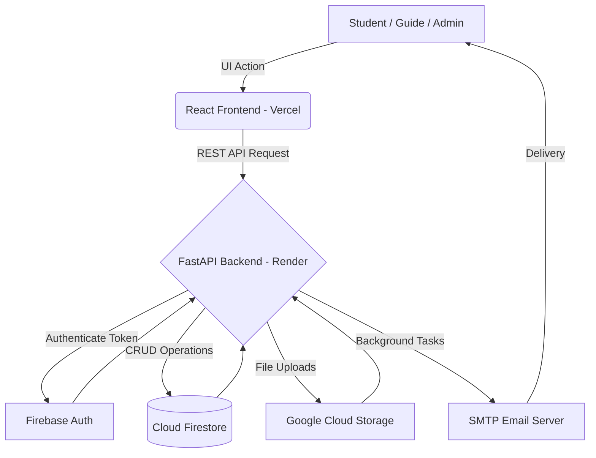

<a name="readme-top"></a>

<div align="center">
  

  <h1 align="center">🎓 DSCE Mini Project Management System</h1>

  <p align="center">
    A robust, full-stack web application designed to streamline student mini-project workflows at Dayananda Sagar College of Engineering.
    <br />
    <a href="https://dsce-mini-project.vercel.app/"><strong>Explore the Demo »</strong></a>
    <br />
    <br />
    <a href="https://dsce-mini-project-mmh0.onrender.com/docs">View API Docs</a>
    ·
    <a href="https://github.com/arunkumarmeda27/dsce-mini-project/issues">Report Bug</a>
    ·
    <a href="https://github.com/arunkumarmeda27/dsce-mini-project/issues">Request Feature</a>
  </p>

  <!-- Badges -->
  <p align="center">
    <a href="https://github.com/arunkumarmeda27/dsce-mini-project/graphs/contributors"></a>
    <a href="https://github.com/arunkumarmeda27/dsce-mini-project/network/members"></a>
    <a href="https://github.com/arunkumarmeda27/dsce-mini-project/stargazers"></a>
    <a href="https://github.com/arunkumarmeda27/dsce-mini-project/issues"></a>
    <a href="https://github.com/arunkumarmeda27/dsce-mini-project/blob/main/LICENSE"></a>
  </p>
</div>

---

## 📖 Table of Contents
<details>
  <summary>Click to expand</summary>
  <ol>
    <li><a href="#about-the-project">About The Project</a></li>
    <li><a href="#built-with">Built With</a></li>
    <li><a href="#key-features">Key Features</a></li>
    <li><a href="#system-architecture">System Architecture</a></li>
    <li><a href="#getting-started">Getting Started</a></li>
    <li><a href="#deployment">Deployment</a></li>
    <li><a href="#contact">Contact</a></li>
  </ol>
</details>

---

## 🌟 About The Project

[![Product Name Screen Shot][product-screenshot]](https://dsce-mini-project.vercel.app/)

Managing student projects using traditional methods like Google Forms, emails, and physical spreadsheets often leads to data fragmentation, communication gaps, and administrative headaches. 

The **DSCE Mini Project Management System** was conceived and engineered to completely digitize and streamline this workflow. From domain selection and automated group formation to faculty allocations and final report grading, the platform serves as a unified hub for Students, Guides, and Administrators.

### Why this project stands out:
- **Comprehensive RBAC (Role-Based Access Control):** Completely isolated and secure portals for Admins, Guides, and Students.
- **Enterprise-Grade Validation:** Strict domain locking (only `@dsce.edu.in` emails are permitted) preventing unauthorized access.
- **Real-time Synchronization:** Powered by Firebase Cloud Firestore, group statuses update instantly.

---

## 💻 Built With

This project modernizes the academic workflow through a highly scalable and decoupled architecture.

### Frontend
* [![React][React.js]][React-url]
* [![Vite][Vite.js]][Vite-url]
* [![TailwindCSS][TailwindCSS]][TailwindCSS-url]
* [![FramerMotion][FramerMotion]][FramerMotion-url]

### Backend
* [![FastAPI][FastAPI]][FastAPI-url]
* [![Python][Python]][Python-url]
* [![Pandas][Pandas]][Pandas-url]

### Cloud & Infrastructure
* [![Firebase][Firebase]][Firebase-url]
* [![Vercel][Vercel]][Vercel-url]
* [![Render][Render]][Render-url]

---

## 🔥 Key Features

| Role | Capabilities |
| :--- | :--- |
| **👨‍🎓 Student** | Forms groups, selects domain, appoints group leader, uploads reports/PPTs to Cloud Storage, tracks approval status. |
| **👩‍🏫 Guide** | Reviews assigned groups, Accepts/Rejects proposals, tracks milestones, views student submissions, exports group data. |
| **👑 Admin** | Approves new user registrations, manages guides, monitors total system overview, enforces group locking, bulk exports analytics (Excel/PDF). |

*   **📧 Automated Email Service:** Custom Python SMTP handler sends HTML-rich automated updates on group creation, acceptances, rejections, and alerts.
*   **📊 One-Click Data Export:** Natively compile cloud data into downloadable `.xlsx` and `.pdf` formats using OpenPyXL and ReportLab.
*   **📂 Native Cloud File Uploads:** Direct integrations with Google Cloud Storage for handling large report repositories securely.

---

## 🏗 System Architecture



---

## 🚀 Getting Started

To get a local copy up and running, follow these simple steps.

### Prerequisites

*   Node.js (v18+)
*   Python (3.10+)
*   Firebase Account with Auth, Firestore, and Storage configured.

### Local Installation

1. **Clone the repo**
   ```bash
   git clone https://github.com/arunkumarmeda27/dsce-mini-project.git
   ```

2. **Backend Setup (FastAPI)**
   ```bash
   cd dsce-mini-project/backend
   python -m venv venv
   source venv/bin/activate  # On Windows: venv\Scripts\activate
   pip install -r requirements.txt
   ```
   *Create a `.env` file in `backend/`:*
   ```env
   EMAIL_ADDRESS=your_email@gmail.com
   EMAIL_PASSWORD=your_app_password
   ```
   *Add your Firebase `serviceAccountKey.json` to the `backend/` directory.*

   *Run the server:*
   ```bash
   uvicorn main:app --reload
   ```

3. **Frontend Setup (React + Vite)**
   ```bash
   cd ../frontend
   npm install
   ```
   *Create a `.env` file in `frontend/`:*
   ```env
   VITE_API_URL=http://localhost:8000
   ```
   *Run the development server:*
   ```bash
   npm run dev
   ```

---

## 🌍 Deployment

The infrastructure is already configured for easy deployment:
- **Frontend** is deployed automatically to **Vercel** on every push to the `main` branch. Ensure env variables are configured in the Vercel dashboard.
- **Backend** is deployed to **Render** utilizing Gunicorn via the `render.yaml` specification.

---

## 📫 Contact

**Arun Kumar Meda**
- GitHub: [@arunkumarmeda27](https://github.com/arunkumarmeda27)
- LinkedIn: https://www.linkedin.com/in/arun-kumar-meda-557b051b8/
- Email: medaarun390@gmail.com
**Project Link:** [https://github.com/arunkumarmeda27/dsce-mini-project](https://github.com/arunkumarmeda27/dsce-mini-project)

<p align="right">(<a href="#readme-top">back to top</a>)</p>

<!-- MARKDOWN LINKS & IMAGES -->
[product-screenshot]: https://via.placeholder.com/1000x500.png?text=DSCE+Mini+Project+Management+System+-+Screenshot+Coming+Soon
[React.js]: https://img.shields.io/badge/React-20232A?style=for-the-badge&logo=react&logoColor=61DAFB
[React-url]: https://reactjs.org/
[Vite.js]: https://img.shields.io/badge/Vite-B73BFE?style=for-the-badge&logo=vite&logoColor=FFD62E
[Vite-url]: https://vitejs.dev/
[TailwindCSS]: https://img.shields.io/badge/Tailwind_CSS-38B2AC?style=for-the-badge&logo=tailwind-css&logoColor=white
[TailwindCSS-url]: https://tailwindcss.com/
[FramerMotion]: https://img.shields.io/badge/Framer_Motion-black?style=for-the-badge&logo=framer&logoColor=blue
[FramerMotion-url]: https://www.framer.com/motion/
[FastAPI]: https://img.shields.io/badge/FastAPI-009688?style=for-the-badge&logo=fastapi&logoColor=white
[FastAPI-url]: https://fastapi.tiangolo.com/
[Python]: https://img.shields.io/badge/Python-3776AB?style=for-the-badge&logo=python&logoColor=white
[Python-url]: https://www.python.org/
[Firebase]: https://img.shields.io/badge/Firebase-FFCA28?style=for-the-badge&logo=firebase&logoColor=black
[Firebase-url]: https://firebase.google.com/
[Vercel]: https://img.shields.io/badge/Vercel-000000?style=for-the-badge&logo=vercel&logoColor=white
[Vercel-url]: https://vercel.com/
[Render]: https://img.shields.io/badge/Render-46E3B7?style=for-the-badge&logo=render&logoColor=white
[Render-url]: https://render.com/
[Pandas]: https://img.shields.io/badge/Pandas-150458?style=for-the-badge&logo=pandas&logoColor=white
[Pandas-url]: https://pandas.pydata.org/
